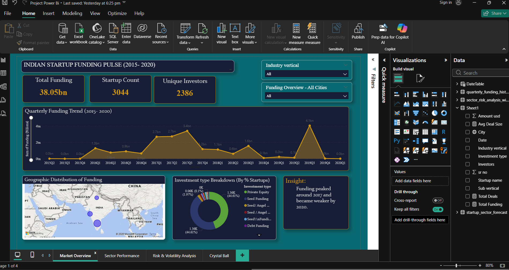
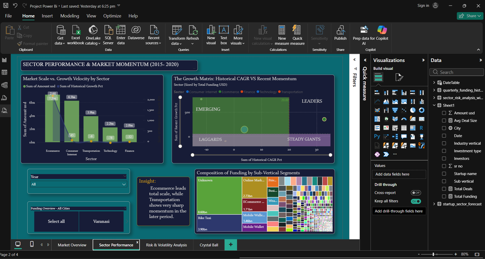
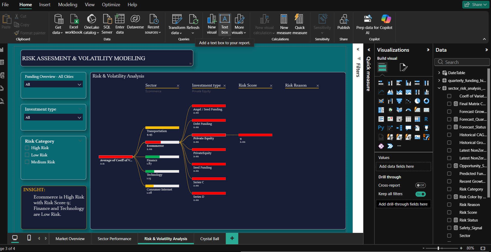
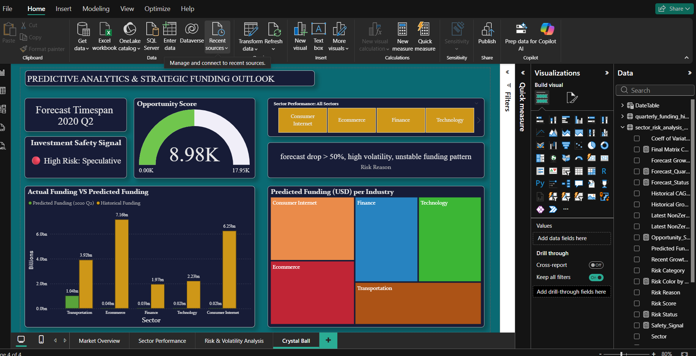

# Indian Startup Funding Analysis | Python + Power BI

## Project Overview
This project analyzes Indian startup funding trends from 2015 to 2020 using Python and Power BI.

I started by downloading the raw dataset from Kaggle. After that, I used Python to clean the raw data, handle missing values, standardize important fields, and prepare a structured dataset for analysis. Then I used Python again to create quarterly funding history, risk analysis, and simple forecast files. Finally, I used these processed files to build a 4-page Power BI dashboard.

### What This Project Can Do
This project analyzes startup funding data, compares sectors, shows risk levels, and gives a simple future funding outlook. It can also help users see which sectors are growing, which are unstable, and which look safer for investment.

### How It Helps
It helps people turn raw funding data into clear business insights. Instead of looking at messy numbers, they can see trends, risk signals, and forecasts in an easy dashboard.

### Who It Helps
This project can help:
- **Investors** to understand which sectors may be risky or promising.
- **Founders** to see how their sector is performing.
- **Analysts** to explore funding trends and build reports.
- **Students and job seekers** to show practical Python and Power BI skills.

### Why It Is Important
This project is important because startup funding data is often messy and hard to understand. By cleaning, analyzing, and visualizing it, the project makes the data useful for decision-making. It also shows real-world skills like data cleaning, DAX, forecasting, and dashboard design.
This project shows my full end-to-end workflow:

**Raw data → Python cleaning → Python analysis and forecasting → Power BI dashboard**

It also shows both technical and analytical thinking through:
- data preparation
- trend analysis
- sector comparison
- risk assessment
- simple forecasting
- dashboard storytelling

## Data Source
- Kaggle Indian Startup Funding Dataset

## Tools Used
- Python
- Pandas
- NumPy
- Power BI
- DAX
- Excel
- CSV

## Project Workflow

### 1. Raw Data Collection
The raw startup funding dataset was downloaded from Kaggle.

### 2. Data Cleaning in Python
I used Python to clean the raw dataset by:
- fixing column names
- handling missing and undisclosed funding values
- standardizing date fields
- cleaning city and sector values
- preparing a structured base dataset for reporting

This step produced:
- [Cleaned Dataset](data/startup_funding_clean-1.xlsx)

### 3. Data Transformation in Python
After cleaning the raw data, I created the following files in Python:

- [Quarterly Funding History](data/quarterly_funding_history.csv) 
  This file was created for quarterly trend analysis by sector.

- [Sector Forecast](data/startup_sector_forecast.csv)
  This file contains sector-level predicted funding values for the next quarter.

- [Sector Risk Analysis](data/sector_risk_analysis_with_simple_forecast.csv)
  This file combines forecasting and risk analysis and includes:
  - predicted funding
  - forecast growth %
  - volatility
  - coefficient of variation
  - historical growth %
  - CAGR
  - recent growth %
  - zero-quarter ratio
  - risk score
  - risk category
  - risk reason

## Dashboard Building in Power BI
Using the cleaned and transformed files, I created a 4-page interactive Power BI dashboard.
[Download the Power BI Dashboard](Report/Indian_Startup_Funding_Intelligence_Dashboard.pbix)

In Power BI, I also:
- built table relationships between the datasets
- created DAX measures for KPI cards and dynamic calculations
- used DAX for conditional color logic in visuals such as the decomposition tree
- created risk signal indicators and summary cards
- designed slicers, filters, and interactive report navigation
- formatted visuals to improve storytelling and readability

## Dashboard Pages

### 1. Market Overview
This page gives a high-level summary of the startup funding landscape.

**Includes:**
- Total funding
- Startup count
- Unique investors
- Quarterly funding trend
- Geographic funding distribution
- Investment type breakdown

### 2. Sector Performance
This page compares sectors based on funding scale, historical growth, and market momentum.

**Includes:**
- Market scale vs growth comparison
- Growth matrix
- Sector momentum analysis
- Sub-vertical funding composition

### 3. Risk & Volatility Analysis
This page focuses on sector-level risk using Python-generated risk metrics.

**Includes:**
- Risk score
- Risk category
- Risk reason
- Volatility-based breakdown

### 4. Predictive Analytics / Forecasting
This page presents a simple funding outlook using the forecast file created in Python.

**Includes:**
- Actual vs predicted funding
- Opportunity score
- Investment safety signal
- Predicted funding by sector
- Forecast-based risk explanation

## Key Insights
- Funding activity was strongest in earlier peak periods and became weaker by 2020.
- Ecommerce had the largest overall historical funding scale.
- Transportation showed strong forecast movement but also high volatility.
- Ecommerce was marked as High Risk in the final risk analysis file.
- Finance and Technology appeared relatively lower risk compared to other sectors.
- The forecast results are useful for directional analysis, not as exact investment advice.

## Files Used in Power BI
- [Cleaned Dataset](data/startup_funding_clean-1.xlsx)
- [Quarterly Funding History](data/quarterly_funding_history.csv)
- [Sector Risk Analysis](data/sector_risk_analysis_with_simple_forecast.csv)
- [Sector Forecast](data/startup_sector_forecast.csv)

## What I Learned
Through this project, I practiced:
- cleaning real-world raw data in Python
- handling missing and messy values
- building time-based sector summaries
- creating simple forecasting logic
- developing a risk scoring approach
- building table relationships in Power BI
- writing DAX measures for KPIs, risk signals, and conditional formatting
- designing a business-focused interactive dashboard
- turning raw data into clear visual storytelling

## Final Note
This project was built as a portfolio project to demonstrate practical skills in Python, data analysis, and Power BI using a real indian startup funding dataset.
